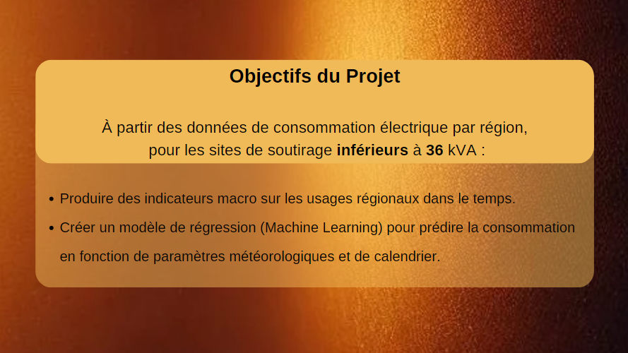
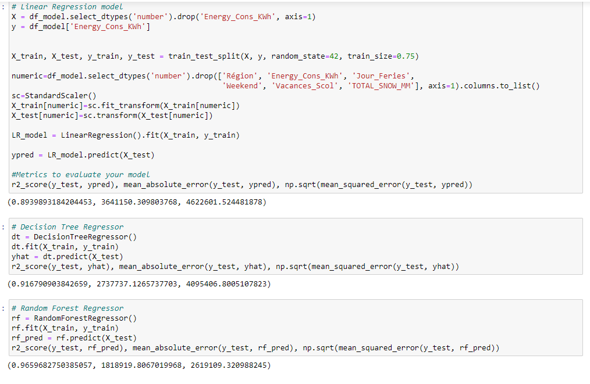
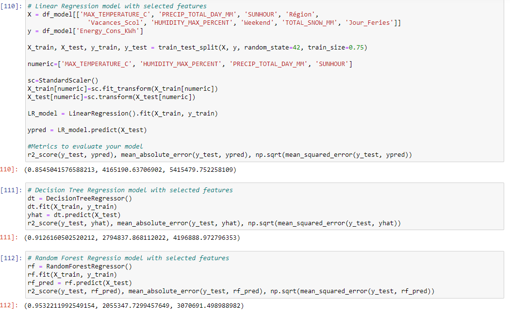
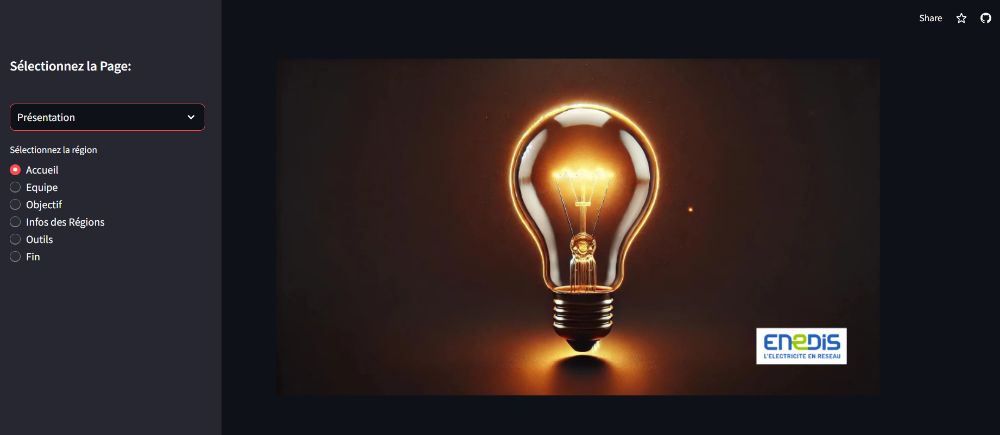
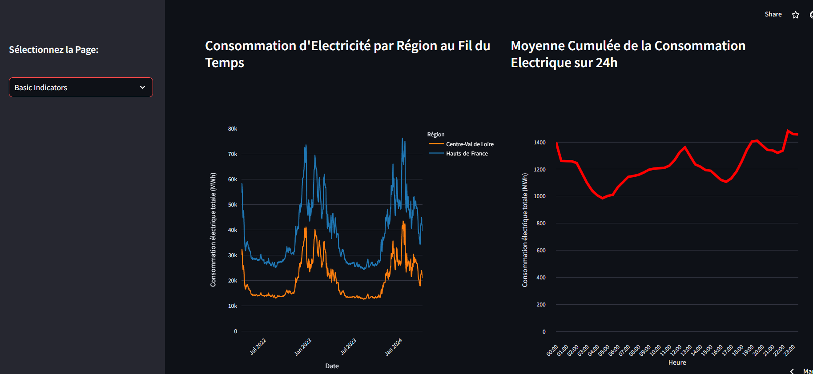
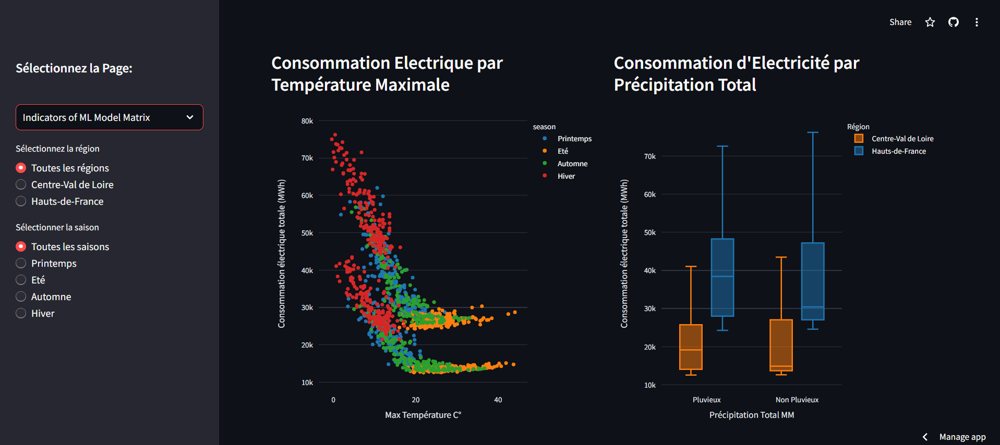
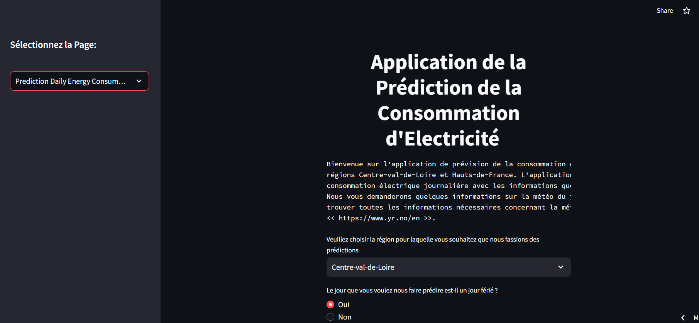

# Electricity Consumption Forecast for two Regions of France
## by Halil Ibrahim Celikel, Ortuno Nicolas an Yermakov Mykhailo

## Summary of the Project

This is a project which I implemented with my classmates Ortuno Nicolas and Yermakov Mykhailo at Wild Code School. The objective of the project was to create a regression model (Machine Learning) to predict electricity consumption as a function of weather and calendar parameters  of the regions Centre-Val-de-Loire and Haut-de-France based on electricity consumption data by region, for extraction sites below 36kVA and then present it with a Streamlit/Dash in which the user will have to choose at least two mandatory variables (temperature, rainfall) and we will suggest optional ones, the most relevant in our opinion.

In order to realize the project, we used the electricity consumption per 1/2 h which we extracted from the website of Enedis, the historical weather data which can be found on the website << https://www.historique-meteo.net/ >> and the various calendar parameters such as school vacations, national holidays, holidays etc. We converted the electricity consumption per 1/2 h data to daily total consumption. For the weather data, we used the weather data of the cities in the regions and we took the mean weather values of the cities because we couldn't find the weather data of the regions directement. 

Firstly, we implemented linear regression model with all of the variables (calendar and weather variables) we have in our ML matrix. But we had to choose the independent variables which affects the most our dependent variables which is electricity consumption. We used SelectKBest feature selection method from ScikitLearn library with the mutual information criteria. We chose the most relevant variables and we put to work our regression model with selected variables. We tried several models such as Linear Regression, Decision Tree Regressor etc. and finally we chose the Random Forest Regressor model because we had the best R2, MAE and MSRE scores with that model. 

Finally, we made an application sur Streamlit which consists of the presentation of the project, basic indicators of the electricity consumption, the indicators which show the relation between the dependent and independent variables we have chosen and the application which predicts the daily electricity consumption based on the user inputs on independent variables. 

## Streamlit application

***1. Presentation Page***

***1. Basic Indicators Page***

***1. ML Indicators Page***

***1. Prediction Page***

## The dataset of the project

We extracted the electricity consumption dataset in the following link:

https://data.enedis.fr/explore/dataset/conso-inf36-region/information/

We extracted the historical weather data in the following link:

https://www.historique-meteo.net/

## Files of the project

~~~~~
- csv_files : Contains the csv files of the streamlit application.
- presentation : Contains the screenshots of the presentaion of the project.
- Projet3_CentreVL_HautsDF.ipynb : Jupyter Notebook of the project which consists of all codes.
- app_projet.py : File of streamlit application
- enedis_dashboard1.py : Consists of all of the visuals in the streamlit application.
- prediction_energy.py : Codes of the application of electricity consumption.
- requirements.txt : Contains the versions of the modules used for the project. I have to add this file to publish it on streamlit.
- 
~~~~~

The link of streamlit page of the recommendation system: '(https://prediction-of-electric-consumption-of-two-regions-kru7e5u7ve43.streamlit.app/)'

